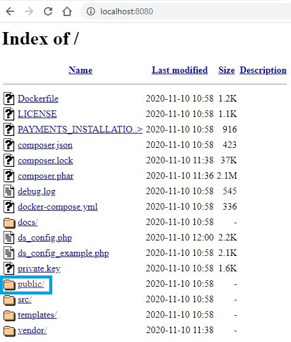
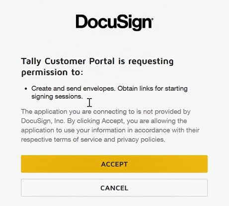

## XAMPP/Apache web server installation

XAMPP/Apache can be configured to run the PHP launcher.

**Step 1.** Download [XAMPP](https://www.apachefriends.org/download.html).

**Step 2.** Run XAMPP as administrator.

**Step 3.** On the XAMPP Control Panel, to the left of Apache, select the red "X" to install Apache. 

The red "X" should become a green checkmark.

## Apache web server configuration

**Step 1.** On the XAMPP Control Panel, to the right of Apache, select the Config button > Apache (httpd.conf). The httpd.conf file should open.

**Step 2.** In httpd.conf, change the default "Listen 80" to "Listen 8080".

**Step 3.** In httpd.conf, change the default "ServerName localhost:80" to "ServerName localhost:8080".

**Step 4.** In httpd.conf, change the default 
DocumentRoot "C:/xampp/htdocs" 
<Directory "C:/xampp/htdocs"> 
to 
DocumentRoot "C:/xampp/htdocs/<Quickstart_folder_name>" 
<Directory "C:/xampp/htdocs/<Quickstart_folder_name>"> 

In httpd.conf, use Ctrl-S to save your changes.

**Step 5.** On the XAMPP Control Panel, to the right of Apache, select the Start button. 

Apache should run.

**Step 6.** Open [http://localhost:8080](http://localhost:8080).

**Step 7.** In the browser window, select the "public" folder. 

If this is your first time opening the PHP Quickstart launcher, you should see the DocuSign OAuth consent window. Select the Accept button and continue to the embedded signing code example.

